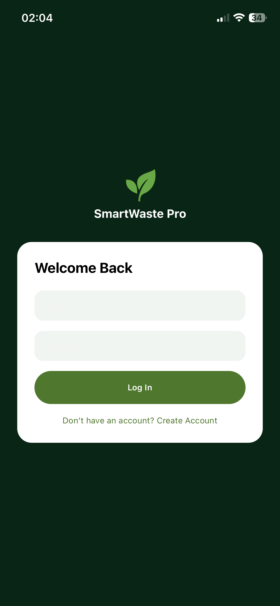
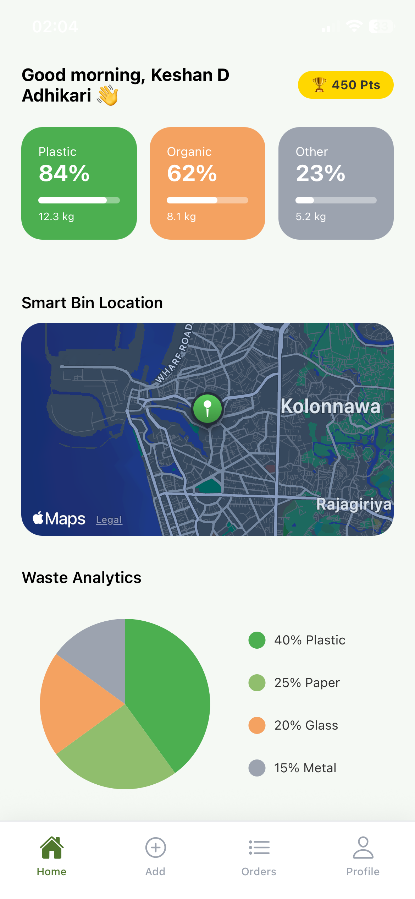
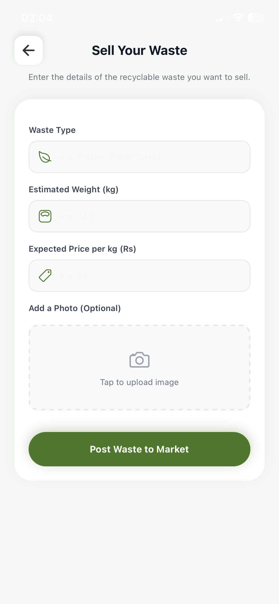
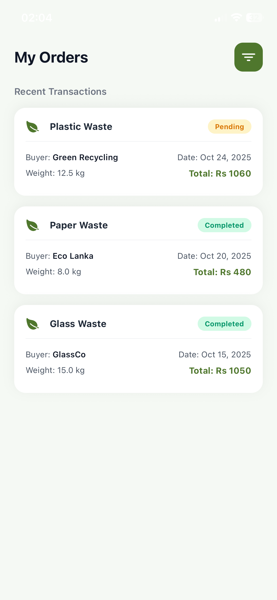
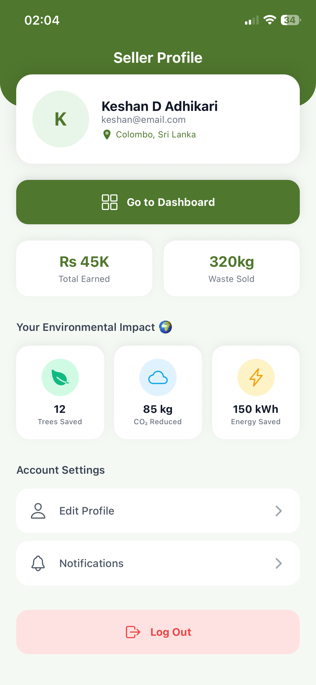
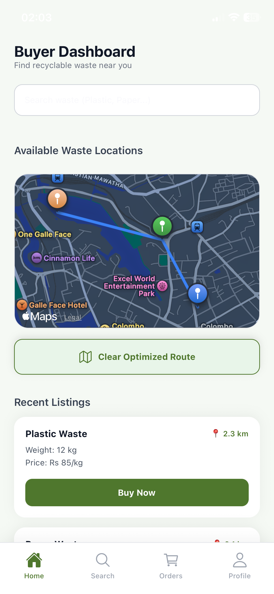
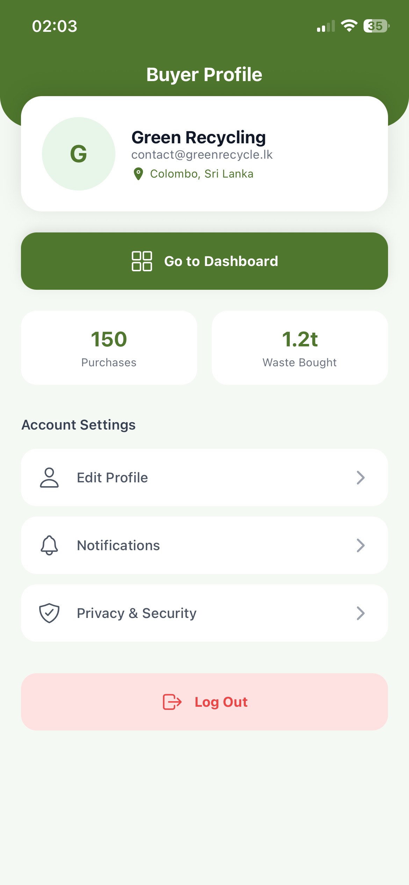

# SmartWaste Pro 🌿

> **IoT-Based Intelligent Waste Management & Recycling Marketplace**  
> Final Year Project — Horizon Campus, Faculty of Information Technology  
> **Author:** Keshan D. Adhikari | **Year:** 2026

---

## What is SmartWaste Pro?

SmartWaste Pro bridges the gap between **waste producers** and **recycling companies** using smart bin hardware, a mobile marketplace, and a real-time cloud backend.

- **Sellers** (waste providers) monitor their smart bins and list recyclable waste
- **Buyers** (recycling companies) browse available waste, navigate to pickup locations, and purchase directly through the app

---

## Features

### Seller Features
- 📊 Real-time IoT bin monitoring (Plastic, Food, Metal compartments)
- ⚠️ Automatic alerts when bin exceeds 80% capacity
- ⚡ Auto-listing on marketplace when bin reaches 70%
- 💰 Earnings tracker (Total earned, This month, kg sold)
- 🔔 In-app notification center with unread badge
- ♻️ Add waste listings with auto price calculation
- 📦 Manage incoming buyer orders
- 🌍 Environmental impact stats (Trees saved, CO2 reduced)
- 👤 Edit profile (saves to Firebase)

### Buyer Features
- 🛒 Browse live marketplace with real-time listings
- 🔍 Search waste by type (Plastic, Food, Metal)
- 📍 GPS distance calculation to seller bin (Haversine formula)
- 🗺️ Map view showing seller bin location with route line
- 💳 Two payment options: Cash on Delivery or Card Payment
- 🏦 VISA / Mastercard auto-detection
- 📋 Order tracking with status badges
- ❌ Cancel pending orders (listing auto-returns to marketplace)
- 👤 Edit profile (saves to Firebase)

---

## System Architecture

```
[ESP32 Smart Bin + Sensors]
         |
         | WiFi → Firebase Firestore
         v
[Firebase Cloud Backend]
(Auth + Firestore + Storage)
         |
    +----+----+
    v          v
[Mobile App] [Admin Panel]
(Seller/Buyer) (Web Dashboard)
```

---

## Technology Stack

### Mobile Application
| Technology | Version | Purpose |
|-----------|---------|---------|
| React Native | 0.81.5 | Cross-platform mobile UI |
| Expo SDK | ~54.0.33 | Development platform |
| Expo Router | ~6.0.23 | File-based navigation |
| TypeScript | ~5.9.2 | Type safety |
| Firebase | ^12.11.0 | Auth, Firestore, Storage |
| react-native-maps | 1.20.1 | Google Maps |
| expo-location | ~19.0.8 | GPS coordinates |
| react-native-chart-kit | ^6.12.0 | Pie charts |
| AsyncStorage | 2.2.0 | Auth session persistence |
| expo-image-picker | ~17.0.10 | Profile photos |

### Cloud Backend (Firebase)
| Service | Usage |
|---------|-------|
| Firebase Auth | Email/password login, role-based routing |
| Cloud Firestore | Real-time database (5 collections) |
| Firebase Storage | Profile image upload |
| AsyncStorage | Auth session persists across restarts |

### IoT Hardware
| Component | Role |
|-----------|------|
| ESP32 Microcontroller | Main IoT controller |
| Ultrasonic Sensor | Bin fill level (%) |
| Load Cell | Waste weight (kg) |
| Moisture Sensor | Food compartment humidity (%) |

---

## Firestore Collections

| Collection | Purpose |
|-----------|---------|
| `users` | User profiles and roles |
| `bins` | Real-time IoT sensor data |
| `marketplace` | Waste listings |
| `orders` | Purchase transactions |
| `notifications` | In-app alerts |

---

## App Screens

```
Welcome Screen
    |
    +---> Login / Create Account
              |
    +---------+---------+
    v                   v
Seller Dashboard    Buyer Dashboard
    |                   |
    +-- Add Waste       +-- [Map Modal]
    +-- Seller Orders   +-- [Payment Modal]
    +-- Seller Profile  +-- Buyer Orders
        |                   |
        +-- Edit Profile    +-- Buyer Profile
                                |
                                +-- Edit Profile
```

---

## Order Flow

```
Buyer taps Buy Now
        ↓
Payment Selection (Cash / Card)
        ↓
Order created in Firestore
        ↓
Listing marked as sold
        ↓
Seller notified instantly
        ↓
Buyer tracks in My Purchases
        ↓
[Cancel] → Order deleted → Listing restored
```

---

## Auto Listing System

When a bin compartment reaches **70% fill level**:
1. System automatically creates a marketplace listing
2. Price calculated: `weight (kg) × price per kg`
3. Seller receives notification
4. Buyer sees ⚡ Auto Listed badge on the card

---

## Installation

### Prerequisites
- Node.js >= 18.x
- Expo CLI
- Firebase project (wast-pro)
- Android/iOS device or emulator

### Mobile App Setup

```bash
# Clone the repository
git clone https://github.com/Keshan-D-Adhikari/wast_pro.git
cd wast_pro/mobile

# Install dependencies
npm install

# Start development server
npx expo start
```

### Seed Mock Data

```bash
# Place serviceAccountKey.json in mobile/scripts/
cd mobile
node scripts/seedMockData.js
```

### Firebase Configuration

Create `mobile/firebaseConfig.js` with your Firebase project credentials:

```javascript
import { initializeApp } from 'firebase/app';
import { initializeAuth, getReactNativePersistence } from 'firebase/auth';
import { getFirestore } from 'firebase/firestore';
import AsyncStorage from '@react-native-async-storage/async-storage';

const firebaseConfig = {
  apiKey: "YOUR_API_KEY",
  authDomain: "YOUR_AUTH_DOMAIN",
  projectId: "wast-pro",
  storageBucket: "YOUR_STORAGE_BUCKET",
  messagingSenderId: "YOUR_SENDER_ID",
  appId: "YOUR_APP_ID"
};

const app = initializeApp(firebaseConfig);
export const auth = initializeAuth(app, {
  persistence: getReactNativePersistence(AsyncStorage)
});
export const db = getFirestore(app);
```

---

## Screenshots

| Screen | Description |
|--------|-------------|
|  | Firebase email/password login |
|  | IoT bin monitoring, pie chart, earnings |
|  | Waste type cards with auto price |
|  | Incoming order management |
|  | Dynamic stats and profile |
|  | Live marketplace with map |
|  | Purchase history and stats |

---

## Research Objectives

| Objective | Status |
|-----------|--------|
| 3-compartment bin with fill, weight, moisture sensors | ✅ Partial (Firestore simulation) |
| Mobile platform for sellers, buyers, alerts, tracking | ✅ Complete |
| Energy-efficient IoT data transmission (EGANT) | ⚠️ Planned |

---

## Project Structure

```
wast-pro/
├── mobile/                    # React Native mobile app
│   ├── app/(tabs)/
│   │   ├── seller/            # Seller screens (5)
│   │   └── buyer/             # Buyer screens (4)
│   ├── firebaseConfig.js      # Firebase setup
│   ├── types.ts               # TypeScript interfaces
│   └── scripts/
│       └── seedMockData.js    # Mock data seeder
├── admin/                     # Web admin panel (WIP)
└── screenshots/               # App screenshots
```

---

## Security Notes

> ⚠️ Before deploying to production:
> - Move Firebase API keys to environment variables
> - Configure Firestore Security Rules
> - Enable email verification
> - Set up Firebase App Check

---

## Author

**Keshan D. Adhikari**  
Registration: ITBIN-2211-0137  
Horizon Campus — Faculty of Information Technology  
BIT (Hons) Networking and Mobile Computing  
Final Year Project — SmartWaste Pro | 2026

**Supervisor:** Ms. A.A.P.W. Athukorala  
**Co-supervisor:** Mr. Daminda Herath