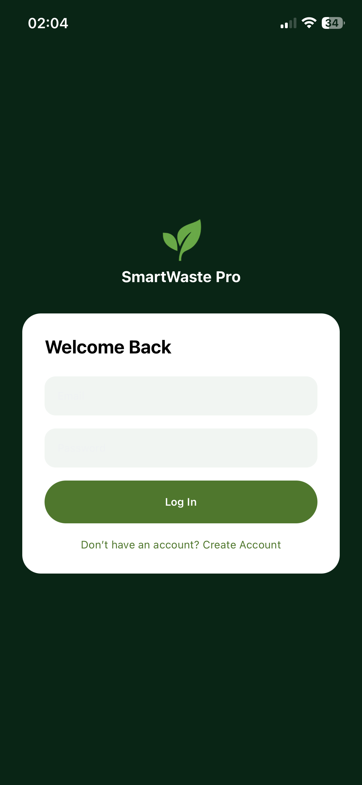
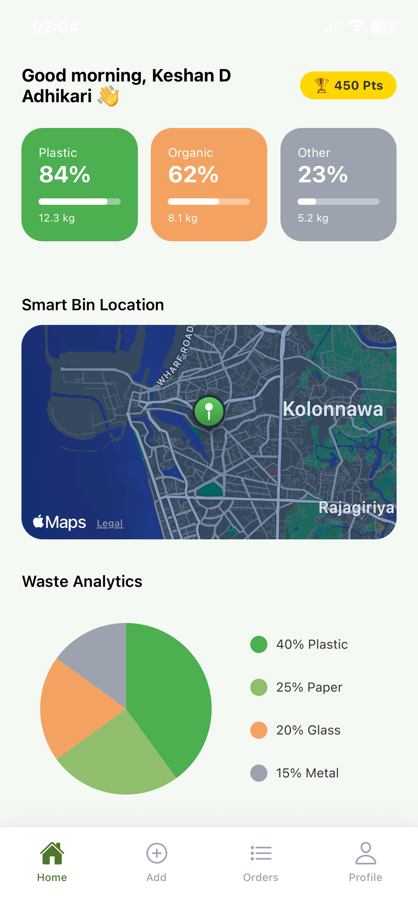
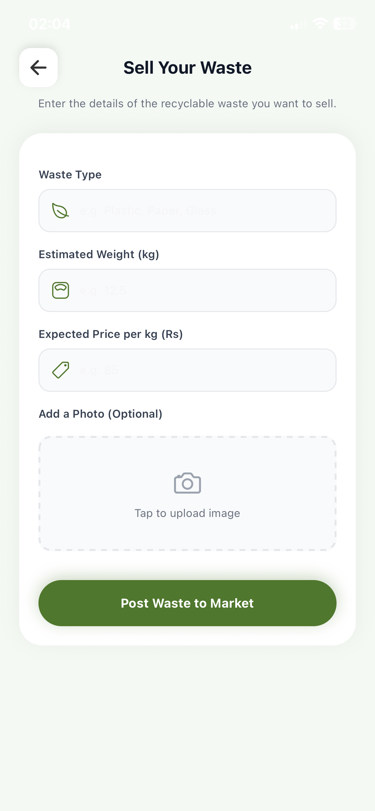
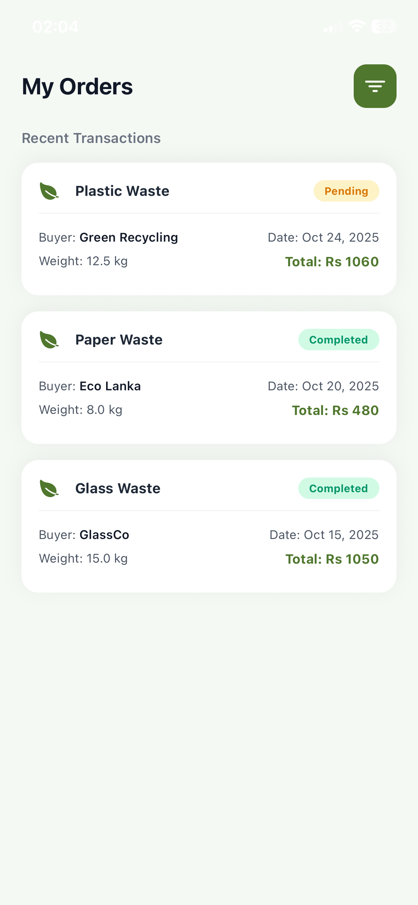
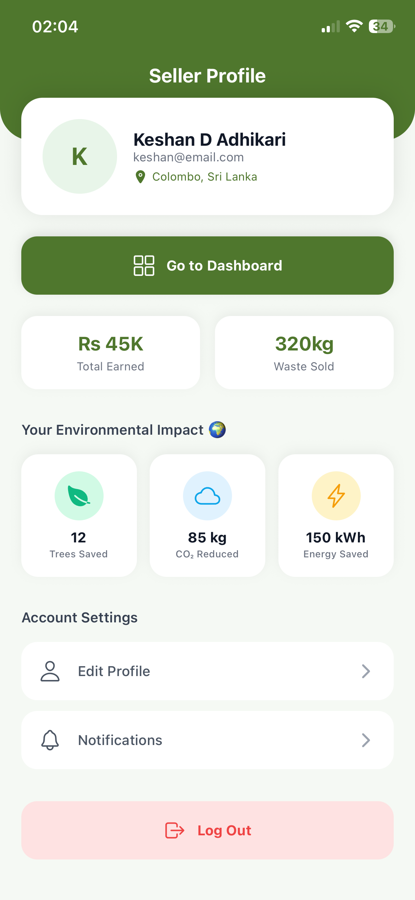
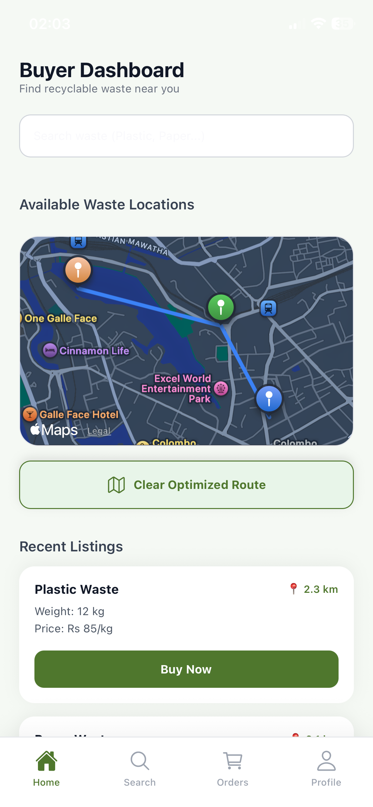
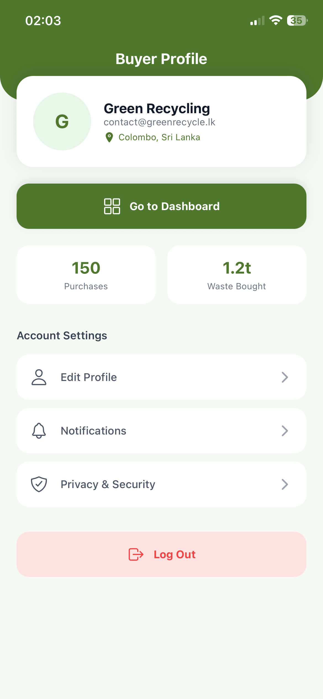

# SmartWaste Pro

> **IoT-Based Intelligent Waste Management & Recycling Marketplace**
> Final Year Project - Horizon Campus, Faculty of Information Technology, BIT (Hons) Networking and Mobile Computing | 2026

---

## What is SmartWaste Pro?

SmartWaste Pro connects **waste producers** and **recyclers**. A smart bin with sensors reports how full it is, a mobile app lets people sell and buy recyclable waste, and a web dashboard lets an administrator oversee everything.

- **Sellers** (waste providers) watch their smart bin live and list recyclable waste for sale.
- **Buyers** (recyclers) browse listings, check the distance, buy directly or make a price offer, and pay by cash or card.
- **Admins** monitor the platform from a web dashboard.

The repo has three parts:

| Folder | What it is |
|--------|------------|
| `mobile/` | React Native (Expo) app for sellers and buyers, plus Firestore rules and Cloud Functions |
| `admin/` | React (Vite) web dashboard for administrators |
| `screenshots/` | App screenshots |

---

## Features

### Seller
- Live smart-bin monitoring for the Plastic, Food and Metal compartments (fill level, weight, moisture)
- Bin status shown exactly as the firmware reports it (`EMPTY`, `LOW`, `HALF`, `75%`, `FULL`, `ERROR`) plus an overweight warning
- Automatic in-app alert when a compartment is full or overweight
- List waste for sale (price = weight x rate per kg), capped by the sensor-reported weight
- **Offers:** review price offers from buyers, accept or reject them; accepting creates an order at the offered price and rejects the other pending offers
- Manage incoming orders, earnings summary, notification centre
- Environmental impact estimates (trees saved, CO2 reduced) and profile editing

### Buyer
- Browse live listings, filter by waste type, search, distance to the seller (Haversine) and a map view
- **Buy now** or **make an offer** with your own price; withdraw a pending offer
- Pay by **cash on delivery** or **card** (Stripe Checkout, test mode)
- Pay by card later for an order created from an accepted offer
- Order tracking; cancel an unpaid order (the order is kept with status `cancelled`, and the listing returns to the marketplace)
- Profile editing and photo upload

### Admin dashboard (web)
- Sign-in restricted to accounts whose `users/{uid}.role` is `admin`
- **Overview:** users, sellers, buyers, available listings, orders and completed revenue
- **Bin Status:** live smart-bin telemetry
- **Users:** search/filter, disable or re-enable an account (a disabled user cannot sign in to the app)
- **Marketplace:** search/filter, remove a listing
- **Orders:** search/filter, change order status
- Tables load 25 rows at a time with a **Load more** button

---

## System Architecture

There are **two separate Firebase projects**: one only for live sensor data, one for the app's own data.

```
 [ESP32 smart bin: ultrasonic + load cell + moisture sensors]
                      |
                      | Wi-Fi
                      v
  Firebase project "IoT"  ->  Realtime Database  bins/Bin001/{plastic,food,metal}
                      |
          read-only live listeners
                      |
        +-------------+--------------+
        v                            v
  [Mobile app]                 [Admin dashboard]
  (Seller / Buyer)             (React + Vite)
        |                            |
        +-------------+--------------+
                      v
  Firebase project "wast-pro" (main app data)
     - Authentication (email/password, roles)
     - Cloud Firestore: users, marketplace, offers, orders, notifications
     - Storage (profile photos)
     - Security rules (mobile/firestore.rules)
     - Cloud Functions -> Stripe Checkout (test mode)
```

Live sensor readings never go through Firestore. They are read straight from the Realtime Database of the IoT project.

---

## Technology Stack

### Mobile app (`mobile/`)
| Technology | Version | Purpose |
|-----------|---------|---------|
| React Native | 0.86.3 | Cross-platform UI |
| Expo SDK | ^57 | Build and dev platform |
| Expo Router | ~57.0.21 | File-based navigation |
| React | 19.2.3 | UI library |
| TypeScript | ~6.0 | Type safety |
| Firebase JS SDK | ^12.11 | Auth, Firestore, Storage, Functions, Realtime DB |
| react-native-maps | 1.27.2 | Maps |
| expo-location | ~57.0 | GPS |
| react-native-chart-kit | ^6.12 | Charts |
| expo-web-browser / expo-linking | ~57 | Stripe Checkout redirect |
| Jest + jest-expo | - | Unit tests |

### Admin dashboard (`admin/`)
React ^19.2, Vite ^7, react-router-dom ^7, Firebase JS SDK ^12, Vitest for tests.

### Backend (Firebase)
| Service | Usage |
|---------|-------|
| Authentication | Email/password sign-in; role stored in `users/{uid}.role` |
| Cloud Firestore | App data (collections below) |
| Realtime Database | Live ESP32 telemetry (separate IoT project) |
| Storage | Profile photos |
| Cloud Functions (Node 20) | `createCheckoutSession` and `verifyCheckoutSession` for Stripe |

### IoT hardware
| Component | Role |
|-----------|------|
| ESP32 | Controller, Wi-Fi upload to Firebase |
| Ultrasonic sensors (x3) | Fill level per compartment |
| Load cell + HX711 (x3) | Weight per compartment |
| Moisture sensor | Food compartment |
| LEDs and buzzer | Local full / overweight indication |

---

## Data

### Firestore collections (main project)
| Collection | Purpose |
|-----------|---------|
| `users` | Profiles and roles (private: owner and admins only) |
| `marketplace` | Waste listings |
| `offers` | Buyer price offers for listings (`pending`, `accepted`, `rejected`, `withdrawn`) |
| `orders` | Purchases (`pending`, `confirmed`, `completed`, `cancelled`) |
| `notifications` | In-app alerts |

### Realtime Database (IoT project)
```
bins/
  Bin001/
    plastic/ { level, weight, status, overweight, timestamp }
    food/    { level, weight, moisture, status, overweight, timestamp }
    metal/   { level, weight, status, overweight, timestamp }
```
The prototype is a single bin, `Bin001`.

---

## Flows

### Direct purchase
```
Buyer taps Buy now -> picks Cash or Card
   Card: Stripe Checkout page -> server confirms it was paid
        |
Order created (must match the listing's seller and price)
        |
Listing marked sold -> seller notified
        |
Buyer tracks it in My purchases
   Cancel (unpaid only): status becomes "cancelled", listing is restored
```

### Offer
```
Buyer makes an offer (price) -> seller notified
        |
Seller accepts: one transaction marks the offer accepted,
                marks the listing sold and creates the order at the offered price
        |  other pending offers are rejected and those buyers notified
        v
Buyer pays by card from My purchases, or pays cash on delivery
```

### Listing (current implementation)
Listing is a manual, one-tap action by the seller. A full or overweight compartment triggers a notification, but the app does **not** yet create a listing automatically at 70% - that is future work.

---

## Installation

### Prerequisites
- Node.js >= 18
- A Firebase project for app data, plus (optionally) the IoT Firebase project the ESP32 writes to
- Android/iOS device with Expo Go, or a web browser

### Mobile app
```bash
git clone https://github.com/Keshan-D-Adhikari/wast_pro.git
cd wast_pro/mobile
npm install
cp .env.example .env      # then fill in your Firebase values
npx expo start            # or: npm run web
```

`mobile/.env` variables (see `mobile/.env.example`):
```
EXPO_PUBLIC_FIREBASE_API_KEY=
EXPO_PUBLIC_FIREBASE_AUTH_DOMAIN=
EXPO_PUBLIC_FIREBASE_PROJECT_ID=
EXPO_PUBLIC_FIREBASE_STORAGE_BUCKET=
EXPO_PUBLIC_FIREBASE_MESSAGING_SENDER_ID=
EXPO_PUBLIC_FIREBASE_APP_ID=
EXPO_PUBLIC_FIREBASE_MEASUREMENT_ID=

# IoT project (ESP32 Realtime Database) - client key + database URL only
EXPO_PUBLIC_IOT_FIREBASE_API_KEY=
EXPO_PUBLIC_IOT_FIREBASE_PROJECT_ID=
EXPO_PUBLIC_IOT_FIREBASE_DATABASE_URL=

# Development only: show simulated bin telemetry when the hardware is offline
EXPO_PUBLIC_USE_MOCK_IOT=false
```

### Admin dashboard
```bash
cd admin
npm install
cp .env.example .env      # VITE_FIREBASE_* and VITE_IOT_FIREBASE_* values
npm run dev
```
To make an admin account, sign up in the app, then set that user's `role` to `"admin"` in the Firestore `users` collection (Firebase console). Admins cannot be created from the app on purpose.

### Firestore rules
```bash
cd mobile
npx firebase-tools login
npx firebase-tools deploy --only firestore:rules --project <your-project-id>
```

### Stripe card payments (test mode)
The Cloud Functions in `mobile/functions/` create and verify Stripe Checkout sessions, so the Stripe secret key never reaches the app. They are **written but not deployed by default**; deploying needs the Firebase **Blaze** plan and a Stripe account in **test mode**.
```bash
cd mobile
npx firebase-tools functions:secrets:set STRIPE_SECRET_KEY    # paste an sk_test_... key
npx firebase-tools deploy --only functions --project <your-project-id>
```
Use Stripe's test card `4242 4242 4242 4242` with any future expiry and CVC. No real money is charged. Until the functions are deployed, only cash on delivery works.

### Mock IoT telemetry (development)
When the ESP32 is offline you can show simulated bin data: set `EXPO_PUBLIC_USE_MOCK_IOT=true` in `mobile/.env`, and `VITE_USE_MOCK_IOT=true` in `admin/.env`. Do not enable it in a real deployment.

### Seed mock data (optional)
Put a `serviceAccountKey.json` in `mobile/scripts/` (never commit it), then `node scripts/seedMockData.js`.

---

## Testing and CI

| Project | Command | What runs |
|---------|---------|-----------|
| `mobile/` | `npm test` | 18 Jest unit tests (distance, status colours, bin status, design tokens) |
| `admin/` | `npm test` | 11 Vitest unit tests (table filters) |

GitHub Actions (`.github/workflows/ci.yml`) runs on every push and pull request:
- **admin:** lint, test, build
- **mobile:** lint, test

The Firestore rules for offers, orders and user profiles were also checked against the Firebase Emulator during development. Those checks are not yet part of the automated suite. Automated coverage is currently limited to logic helpers, not full screens, payments or Cloud Functions.

---

## Project Structure

```
wast-pro/
├── mobile/
│   ├── app/(tabs)/
│   │   ├── Welcome, Login, CreateAccount
│   │   ├── seller/   SellerDashboard, AddWaste, SellerOffers, SellerOrders, SellerProfile, EditProfile
│   │   └── buyer/    BuyerDashboard, BuyerOffers, BuyerOrders, BuyerProfile, EditProfile
│   ├── components/ui/        Shared UI (button, card, badge, chip, bottom-nav, ...)
│   ├── constants/            Design tokens, bin-status helpers
│   ├── functions/            Cloud Functions (Stripe Checkout)
│   ├── firestore.rules       Security rules
│   ├── firebaseConfig.js     Main Firebase project
│   ├── iotConfig.js          IoT Realtime Database + mock mode
│   └── types.ts              TypeScript interfaces
├── admin/
│   └── src/  pages/ (Overview, BinStatus, Users, Marketplace, Orders), lib/, components/
├── .github/workflows/ci.yml
└── screenshots/
```

---

## Security

- Firebase client config is read from environment variables; `.env` files are gitignored and never committed.
- All access control is enforced by **Firestore security rules** (`mobile/firestore.rules`), which run on the server:
  - `users` are private (owner and admins only). Sign-up can only create a seller or buyer, and a user cannot edit their own role, points or disabled flag.
  - `orders` can only change in specific ways (buyer cancels an unpaid order or pays an offer order; seller advances status or marks cash paid; admin changes status). Price and parties cannot be changed. A direct purchase must match the real listing's seller and price.
  - A seller can create an order for an offer only while accepting that same offer, at the offered price.
  - Notifications can only be sent between the two parties of the same order or offer.
  - Orders and users are never deleted.
- The Stripe secret key lives in a Cloud Functions secret, not in the app.
- Never put a Realtime Database legacy secret in the app or in the repo.

---

## Known Limitations

- **Card payments** run in Stripe test mode and the functions need deploying. The order is written by the app after payment is confirmed; a stronger design creates the order on the server with a Stripe webhook.
- A buyer paying an accepted-offer order marks it paid from the app after the server confirms payment; the rules limit which fields can change but cannot themselves verify the payment.
- Buy-now creates the order and marks the listing sold as two separate writes, so two buyers could race for the same listing.
- A single prototype bin (`Bin001`) is supported, not one bin per seller; the bin has no GPS, so the seller map uses a default location.
- Map "routes" are straight lines, not road directions.
- Automatic listing at 70% is not implemented.
- Email verification, password reset and Firebase App Check are not yet set up.
- Automated test coverage is thin (see Testing and CI).
- The `users` collection is private, but marketplace listings, offers and orders still carry the seller and buyer names.

---

## Research Objectives

| Objective | Status |
|-----------|--------|
| 3-compartment bin with fill, weight and moisture sensors | Working prototype, one bin |
| Mobile platform for sellers and buyers: alerts, marketplace, offers, orders | Implemented |
| Admin web dashboard for oversight | Implemented |
| Energy-efficient IoT data transmission (EGANT) | Planned |

---

## Screenshots

| Screen | Description |
|--------|-------------|
|  | Email/password login |
|  | Bin monitoring, chart, earnings |
|  | Waste type cards with auto price |
|  | Incoming orders |
|  | Stats and profile |
|  | Live marketplace |
|  | Purchase history and stats |

---

## Team

| Name | Registration |
|------|--------------|
| Keshan D. Adhikari (A.M.K.D. Adhikari) | ITBIN-2211-0137 |
| W. Thilan Avishka | ITBNM-2211-0199 |

The ESP32 firmware and its documentation are the work of the group; this repository contains the apps, the rules and the cloud functions.

Horizon Campus - Faculty of Information Technology, BIT (Hons) Networking and Mobile Computing.

**Supervisor:** Ms. A.A.P.W. Athukorala
**Co-supervisor:** Mr. Daminda Herath
